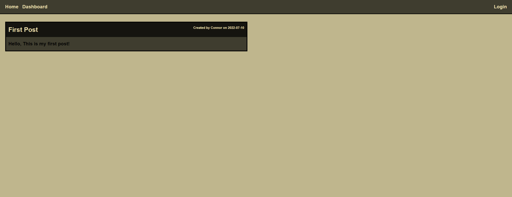
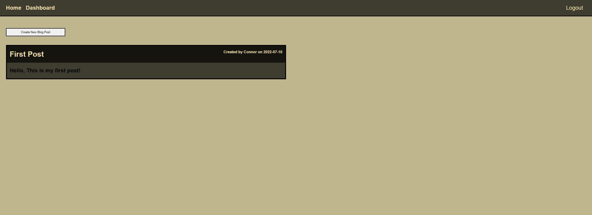
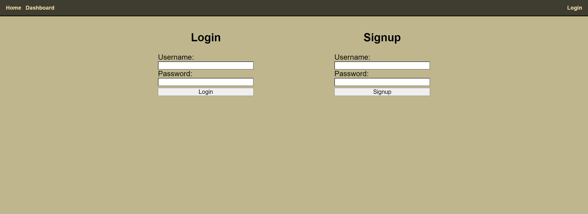

# Tech Blog Forum

## Link

https://vast-shore-46783.herokuapp.com/

## Description

The goal of this project is to develop a blog site for developers to talk about tech.  The site will be built as a full-stack application, utilizing mySql as the database that holds user info.  It will also utilize an MCV paradigm as its architetural structure.  

Three base navigational links are present on the web page, the home, dashboard, and login.  The homepage will display all posts by all users.  Upon clicking on any post, all of the comments related to that post will be presented.  Alongside this, the user will also have the option to leave a new comment on the post.  The dashboard option will take the user to all of their posts, if they are logged in.  Upon clicking on one, the user will be able to either delete or update the content of the post.  Lastly the login tab will allow users to login to their account, or sign up for a new one.

## Steps Taken

1.  Created a MVC folder and file structure, included and installed all required npm packages

2.  Set up server file along with routes to other files and folders (connection, models, controllers)

3.  Created models and relationships for the sql tables in models

4.  Coded base structure of handlebars files so that basic information could be rendered

5.  Set up login / logout functionallity using public/.js files paired with controllers

6.  Set up all other controllers to handle displaying information on each page

7.  Styled pages by editing handlebars files and CSS

8.  Ran through code functionallity and fixed bugs

9.  Deployed to Heroku

## Screenshots

### Homepage

### Dashboard

### Login

